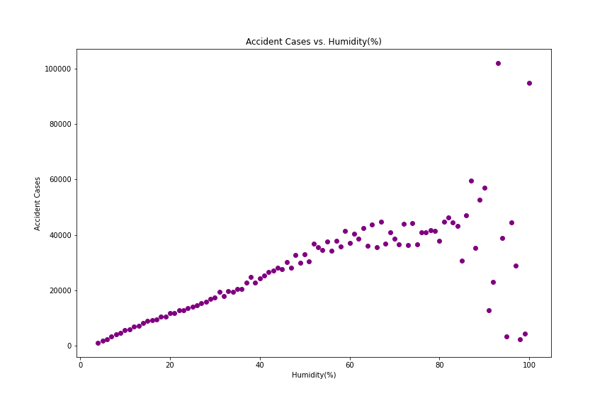
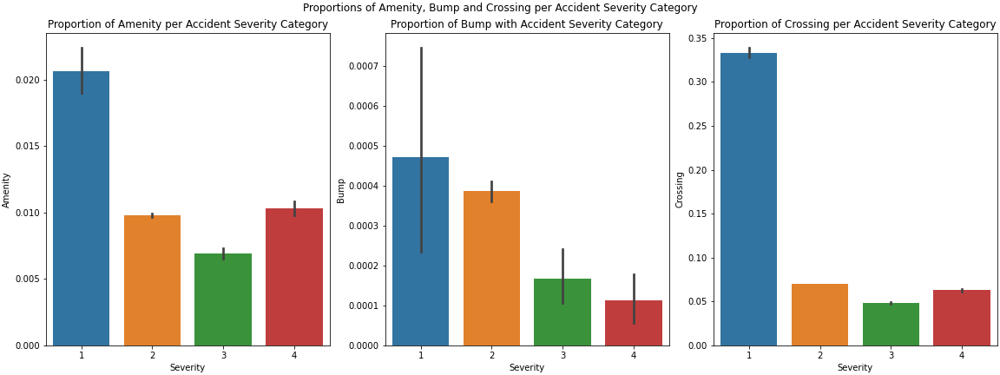
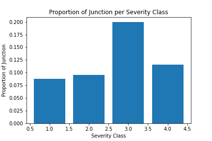
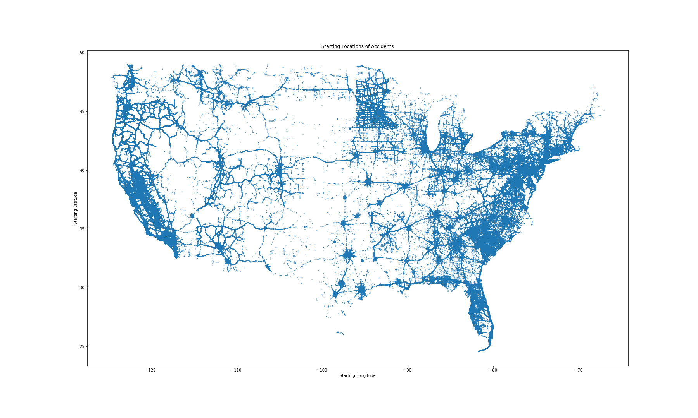
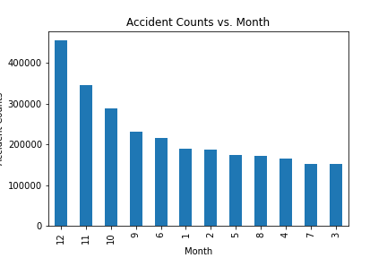
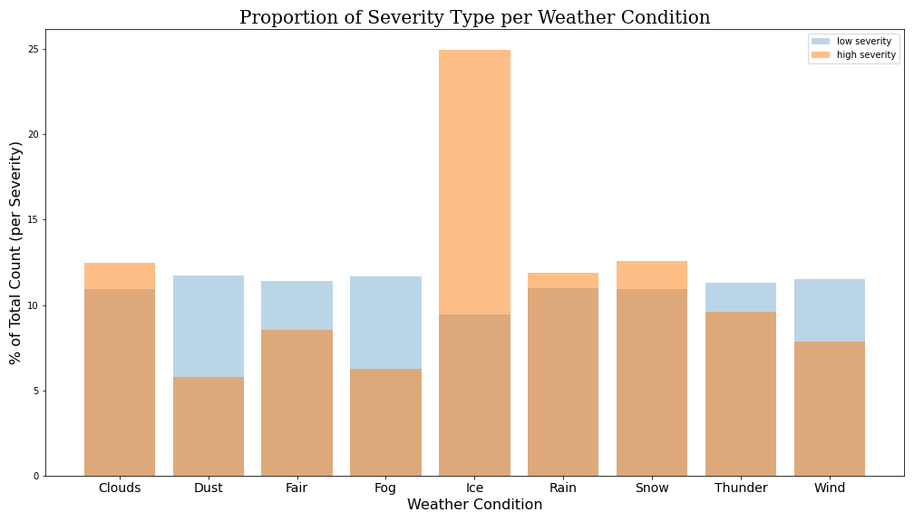
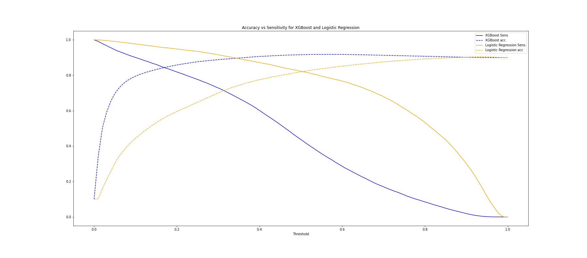

# Project 4 - Exploring and Predicting U.S. Car Accident Severity  
## Problem Statement
Based on US Accident data from 2016-2021, what recommendations and observations can be made towards reducing severity of automobile accidents?

Goal: Balance model performance and informativeness
- Generating findings regarding U.S. car accidents and their severities
- Predict the severity of an accident based on geospatial, temporal, and weather conditions

Benefits:
- General public (i.e. pedestrians, bikers, drivers, etc.)
- Policymakers and city planners

## Executive Summary
Automobile accidents are a leading cause of death in the U.S., responsible for 42,915 deaths in 2021. On a global basis, more individuals die from crashes than from HIV/AIDS. Furthermore, from an economic perspective, both fatal and nonfatal crash injuries are projected to cost the world economy around $1.8 trillion dollars from 2015-2030. The challenge is despite improvements in vehicle architectures and general road safety measures (i.e. using a seat belt, driving without distractions, obeying speed limits, etc.), car crash fatalities in the U.S. have stayed relatively consistent over the past decade. 

Whether you’re a pedestrian, driver, policymaker, etc., these statistics are concerning. In order  to bolster public safety awareness and reduce car accident severities, we’ve developed several insights and models. Our learnings can be utilized to optimize city planning efforts such as transportation infrastructures as well. 

Following data collection via Kaggle, cleaning, feature selection, and exploratory data analysis, we proceeded towards modeling. Consisting of a two-step process involving various clustering and classification models, we performed different hyperparameter tuning methods, data balancing techniques, threshold adjustment, and evaluation of key metrics to arrive at our final model. Optimizing for sensitivity followed by accuracy, our final XGBoost model resulted in 95% 69.5% respectively. 

Through our modeling and analysis, we determined the following significant factors in accident frequency and severity:

**Increasing Accident Severity**:
- Month of the year (specifically later months in the year: October, November, December)
- Timezone and Location (pacific time zone and particularly the state of California)
- Timing (accidents occurring at 6am or 5pm appear to have higher chances of being severe)
- Icy Weather Conditions 
 
**Increasing Accident Frequency**:
- Presence of Intersections
- Location (coastal areas)
- Humidity (%)
 
**Decreasing Accident Severity**:
- Presence of Amenities, Bumps, Crossing, Roundabouts, Railway Stations, Traffic Calming Measures, Traffic Signals

## Data Acquisition / Ingestion: Kaggle (US-Accidents: A Countrywide Traffic Accident Dataset)
Data consists of roughly 3,000,000 car accidents spanning from 2016-2021. The dataset consists of geospatial, temporal, and weather condition features collected via APIs that broadcast traffic information from departments of transportation, traffic cameras, etc. The data was csv formatted and stored locally during project development due to Github file size restraints.

## Data Cleaning: 
### Feature Removal:
- Number, representing street number, is too specific of a focus for our purposes
- There's no discernible relationship between Zipcode and frequency of accidents or severity of accident
- Wind Chill is highly correlated with temperature and wind speed, with both of the other features having a higher correlation with our target variable, Severity.
- Airport Code isn't relevant to our analysis
- Nautical Twilight and Astronomical Twilight are similar to our chosen day/night metric (day/night based on Sunrise/Sunset)
- Weather Timestamp isn't relevant to our analysis
- ID of accident case isn't relevant to our analysis
- End_Time, End_Lat, End_Lng aren't meaningful for exploring how to reduce accident severity (should be exploring the start time, latitude, longitude of accidents)
- Description of the accident isn't relevant to our analysis 
- Country is the same across the entire corpus as it details accidents occurring in the U.S.
- Civil Twilight is similar to our chosen day/night metric (day/night based on Sunrise/Sunset)
- Distance(mi) or length of the road affected by the accident isn't meaningful for exploring the reduction of accident severity as it tracks a value obtained as a result of the accident

### Missing Values: 
- Imputation of precipitation values based on weather condition categories and domain knowledge (i.e. ‘Clear’ -> Precipitation: 0, other categories ->  median precipitation)
- Imputation of wind speed values based on wind direction categories (i.e. ‘Calm’ -> Wind Speed: 0)
- Dropped remaining missing values as they constitute less than 2% of our data cumulatively 

## Data / Features Used:

| Name | Type | Description |
|------|------|-------------|
| Junction | binary | Presence of an intersection at or near the accident location |
| No Exit | binary | Lack of an exit route at or near the accident location |
| Railway | binary | Presence of a railway (i.e. light rail, industrial railway, etc.) at or near the accident location |
| Roundabout | binary | Presence of a roundabout at or near the accident location |
| Station | binary | Presence of a railway station at or near the accident location |
| Stop | binary | Presence of an intersection where some or all vehicles must stop at or near the accident location |
| Traffic Calming | binary | Presence of measures put in place for slowing down traffic at or near the accident location |
| Traffic Signal | binary | Presence of a traffic signal at or near the accident location |
| Temperature | continuous | Fahrenheit measure of temperature |
| Humidity | continuous | Percentage measure of humidity |
| Pressure | continuous | Air pressure in inches |
| Visibility | continuous | Visibility in miles |
| Wind Speed | continuous | Wind speed in miles per hour |
| Precipitation | continuous | Precipitation in inches |
| Amenity | binary | Presence of an amenity at or near the accident location |
| Bump | binary | Presence of a speed bump or hump at or near the accident location |
| Crossing | binary | Presence of pedestrian crossings or other types at or near the accident location |
| Weather Condition | categorical | Weather conditions (i.e. rain, ice, etc.) |
| Street | categorical | Street name |
| Start Time | continuous | Start time of accident based on local timezone |
| Side | categorical | Side of the street (Right/Left) of the accident location |
| Timezone | categorical | Timezone based on the accident location (i.e. eastern, central, pacific, etc.) |
| Sunrise Sunset | categorical | Period of day (i.e. day or night) based on sunrise/sunset |
| City, County, State | categorical | |
| **Severity** | categorical | Severity of the accident, a number ranging from 1-4, where 1 denotes the least impact on traffic and 4 denotes a significant impact on traffic |

## Exploratory Data Analysis, Visualizations, and Findings

- There appears to be a positive, linear relationship between humidity and frequency of accident cases, while most accidents occur for humidity levels between 0-40% 

- Severity 1 and 2 accidents (low-severity) have a higher proportion of bumps and crossing present than severity 3 and 4 accidents (high-severity)
- The same can be said for the presence of roundabouts, railway stations, traffic calming measures, and traffic signals
- This suggests that the features listed above reduce accident severity

- Severity 3 and 4 accidents (high-severity) have a higher proportion of junctions or intersections present than severity 1 and 2 accidents (low-severity) 
- This suggests that junctions or intersections increase accident severity

- Car accidents in the U.S. are largely concentrated in coastal areas

- Majority of accidents and high-severity accidents occur towards the end of the year (months 10, 11, 12)

- Low severity accidents are even across the board, suggesting they occur at approximately the same rate independent of weather conditions
- The most notable distinction in accident proportions occur in icy conditions, where roughly 25% of high-severity accidents occur in icy conditions
- Low severity accidents occur at a slightly higher rate in dusty, fair, fog, and windy conditions as well

**Other Findings**:
- Higher frequency of accidents occurring on the right side of the street, which makes sense given the U.S.’s right hand traffic 
- Cities with the highest frequency of accidents: Miami, Los Angeles, Orlando, Dallas, Houston, Charlotte, Sacramento, San Diego, Raleigh, Minneapolis
- Counties with the highest frequency of accidents: Los Angeles, Miami-Dade, Orange  
- States with the highest frequency of accidents: CA, FL
    - There are a variety of reasons for why this could be the case, such as a higher proportion of drivers/bikers/etc., poor urban planning, etc. Further research can be done to validate these claims.

## Modeling Approach
We sought to first explore clustering and PCA analyses to see if we could improve our subsequent classification models (predicting accident severity class) by incorporating cluster labels and findings. Our clustering techniques included KMeans and KPrototypes, while our classification algorithms included Logistic Regression, Random Forests, XGBoost, and Neural Networks. 

Our final chosen classification model for informativeness, sensitivity, and accuracy optimization is a XGBoost model with 95% sensitivity, 69.5% accuracy, and probability threshold of 0.05. 

### Clustering and PCA
Clustering was attempted to determine whether the data could be grouped into discrete chunks consisting of certain feature similarities. PCA was done to see if there were any feature combinations that contributed significantly more than others to the understanding of the data.

#### Clustering - KMeans algorithm
The KMeans clustering algorithm requires non-categorical numeric values, and is native to scikit-learn as a highly-popular and efficient clustering algorithm. For this algorithm, we used the original cleaned data set, with categorical features one-hot encoded.

The KMeans clustering algorithm was tuned on a 25,000 sample subset of the data. This subset of data was fit to various KMeans instances, each with a different cluster count in an attempt to determine an ideal cluster count for the algorithm. Ultimately this narrowed down to fitting algorithms of 55-85 clusters, which provided a top silhouette score at 70 clusters of 0.136. This analysis took 35 minutes to run.

Due to the low silhouette score on the full feature set, we attempted a clustering analysis on a smaller feature set consisting of only the weather-related continuous numeric features. We performed the same process as above, resulting in a top silhouette score of approximately 0.40 at 9 clusters. This fitting and scoring took over 2 hours.

Due to the generally low silhouette score and time commitment of running the model, this model was abandoned. It did not look like the data would cluster well under this model.

#### Clustering - KPrototypes algorithm
The KPrototypes clustering algorithm is a hybrid of KMeans and KModes algorithms. While KMeans is useful for non-categorical numeric values, KModes works on categorical values by replacing a distance metric by a count metric for categorical features in fitting the model. KPrototypes combine the two. Thus, incorporating the model entailed a little extra complexity, in that one-hot encoded categorical data had to be collapsed back into single columns and fed to the algorithm separately.

Other than these technical operations, the same procedure was taken as above on KMeans in determining ideal hyperparameters. However, due to the added complexity of the KPrototypes model, it ran a lot slower than KMeans, and sample sizes fed into the model had to be adjusted accordingly in order to justify the experimentation time. A review of model fitting on every third cluster between 10 and 30 (8 separate fittings) took nearly 1 hour on only 5,000 samples for each fit.

The means of the continuous features in each cluster were compared to determine if any patterns or separation appeared within and between clusters. The graph of weather-related features showed no clear sign of any obvious clustering, and in fact showed many features that had means repeated across clusters, suggesting that these features did not impact the cluster decisions.

Ultimately, due to the extended run-time of the model and the early analysis that showed little to no obvious clustering behavior, this model was abandoned.

#### PCA
The goal of PCA was to see if there were any feature combinations that explained the data better or more commonly than other feature combinations.

This analysis was performed as a standard PCA transformation, which sought to determine how many components explained over 80% of the variance in the data. PCA showed that 85 components were taken into account in explaining over 80% of the variance. These variance ratios were plotted, and the plots showed no strong tendency towards any small subset of components, suggesting that this data does not have a strong split or strong clustering behavior.

This analysis was therefore abandoned. The data does not seem to have any strong clustering tendency.

### Classification 
We used MinMaxScaler to transform features by scaling each feature to a given range. For our case we had 0 and 1 scale used. Following that we used random sampling with 1 million data as a subset since the dataset we had in hand was large for the computer to process efficiently with almost 3 million rows of accident cases. While working on the project, we found that observation in one class was higher than the observation in another class which created a class imbalance. Majority class had around 90% observation whereas the minority class had 10% observation. This resulted in higher accuracy in majority class and low accuracy in minority class thus failing to capture the minority class.
Hence, we went on to use SMOTE (synthetic minority sampling technique) to deal with imbalanced classes. This technique generated synthetic data for the minority class. After SMOTE technique we had balanced on each class: 50:50. For the train-test split, we used 70% on the training data and 30% on the testing data. Additionally, we made 2 passes at the Machine learning model, one with the overall dataset and other after using MinMax scale and SMOTE.

#### Logistic Regression
The logistic regression model fit on the subsample of 1 million data points has an accuracy of .83 on the test dataset. While this is significantly above the baseline score on the subsampled dataset of 50%, it was determined that it is more important to improve the sensitivity score of the dataset in order to reduce the total number of false negatives. While the model parameters were not changed, the threshold for determining if an accident was severe was lowered to .19 to increase sensitivity on the whole dataset to 95%.  Decreasing the threshold led to a model accuracy of 59%. 

#### Random Forests
The random forests model has similar performance scores to the logistic regression model but is significantly more computationally intensive so no further exploration into this classification method was taken. 

#### XGBoost
The XGBoost was used since it fits quickly on large datasets. It created the highest accuracy with 95% when compared to logistic and random forest which had 82% and 81% respectively. Since our objective was to optimize for sensitivity, the threshold for determining a severe accident was lowered to .05. After lowering the threshold, the sensitivity of the model was .95. The subsequent accuracy of the model was .695, which is .1 greater than the accuracy of the threshold adjusted logistic regression model. XGBoost was therefore the best performing model when optimizing primarily for sensitivity. 

A visual demonstration of how our threshold was chosen to balance sensitivity and accuracy

#### Neural Networks
We attempted to use neural networks on this data to validate the previous model results as well as see if better predictive performance was available. Two separate networks were run with different layer and node counts, and both resulted in similar metrics. Specifically, the first (smaller) neural network reached an accuracy of 0.81 and sensitivity of 0.89. The second (larger) neural network reached an accuracy of 0.86 and sensitivity of 0.83.

These scores did not significantly outperform the other models, and due to the inability to interpret the neural networks, these scores served more to validate our other models than replace them.

### Metrics and Performance Evaluation:
Accuracy: Maximize amount of correctly labeled accident severities
Sensitivity: Reducing false negatives (incorrectly predicting a high-severity accident to be low-severity)
    
- Baseline Model Performance:  0% Sensitivity, 90% Accuracy
- Best Model Performance: 95% Sensitivity, 69.5% Accuracy

## Limitations 
While there were many limitations in the modeling process due to the immense size of the dataset and the processing power needed to create complex models, the primary limitation of our models come from a lack of features that can predict severity. All of the features of the dataset were environmental features, so certain subjective predictors of accident severity are missing, such as car speed prior to impact. Since all of our models had similar accuracies, it is apparent that our data does not fully capture what contributes to accident severity. Adding speed at impact, for example, would possibly improve our data and allow for the use of more advanced modeling techniques. Another possible limitation of our data is the subjectivity of severity classification. If better data was collected, computational power would be the next limiting factor. 

## Recommendations / Next Steps
Our models along with our EDA appear to show that the current measures in place for slowing down traffic, such as speed bumps and signs, are somewhat effective. Two high predictors of severity were if the time of day was around 6am and 5pm, which coincide with commute times. This inherently makes sense as an accident will have a greater effect on traffic during high density travel times.  Severe accidents also seem to take place at junctions and intersections so, according to our model, extra care should be taken at intersections and additional measures should be enacted to prevent accidents at intersections. Other solutions such as rotaries can reduce severity since there is little opportunity for head on collisions in this environment. Icy conditions also appear to be a predictor of accident severity. One possible solution would be salting or sanding roads heavily to prevent loss of traction. Utilizing AWS / other cloud computing techniques for increased computational power would improve our model tuning process as well.

## Table of Contents
- code
    - Cleaning.ipynb: Column Removals, Missing Value Imputation
    - EDA.ipynb: Visualizations and Interpretations
    - Preprocessing.ipynb
    - Clustering-and-PCA.ipynb: KMeans, KPrototypes, PCA and Performance Evaluation
    - Models_Classification.ipynb: Logistic Regression, Random Forests, XGBoost and Performance Evaluation
    - NN_Classification.ipynb: Neural Network and Performance Evaluation
- images
    - Various relevant visualizations
- models
    - Saved neural network model 
- data (all data files should be placed in this directory; links below)
    - [Source](https://drive.google.com/file/d/18nSukplBmXZDy4DNswwo1F8pbyRRmspV/view?usp=sharing)
    - [Clean 1](https://drive.google.com/file/d/1oTmo0u0msFqQyycw-hwVg7ZxLFkKf5vT/view?usp=sharing)
    - [Clean 2](https://drive.google.com/file/d/1xFn4WmuMlYzekH-aexhJ806qg0o3Bre5/view?usp=sharing)
    - [Weather Condition and Street Type Clean](https://drive.google.com/file/d/1QsabJIPb1HxWB307e7T6bJFI71vtY3zO/view?usp=sharing)
    - [Final One-Hot-Encoded Data](https://drive.google.com/file/d/1T-XXiohEivRlELxkU_XcauGB2-ICosaz/view?usp=sharing)

## Software Requirements 
- Pandas
- Numpy
- Scikit-learn
- Matplotlib
- Seaborn
- Tensorflow / Keras
- (`kmodes`)[https://pypi.org/project/kmodes/]: for KPrototypes algorithm used in clustering
- (`imbalanced-learn`)[https://pypi.org/project/imbalanced-learn/]: for resolving class imbalance

## Acknowledgments
- Moosavi, Sobhan, Mohammad Hossein Samavatian, Srinivasan Parthasarathy, and Rajiv Ramnath. “A Countrywide Traffic Accident Dataset.”, arXiv preprint arXiv:1906.05409 (2019).
- Moosavi, Sobhan, Mohammad Hossein Samavatian, Srinivasan Parthasarathy, Radu Teodorescu, and Rajiv Ramnath. “Accident Risk Prediction based on Heterogeneous Sparse Data: New Dataset and Insights.” In proceedings of the 27th ACM SIGSPATIAL International Conference on Advances in Geographic Information Systems, ACM, 2019.
- https://www.cdc.gov/injury/features/global-road-safety/index.html
- https://www.bankrate.com/insurance/car/car-crash-statistics/

